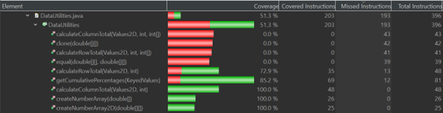
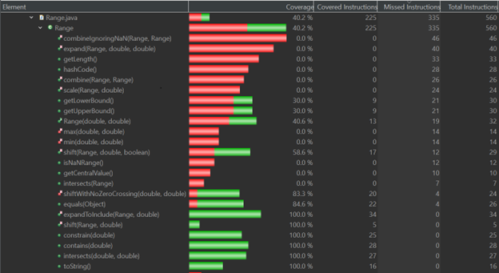
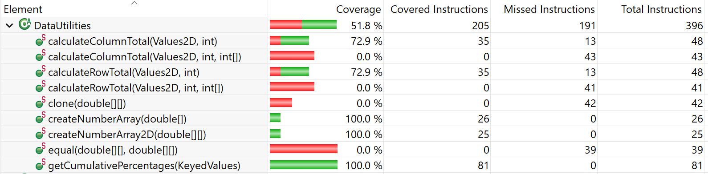
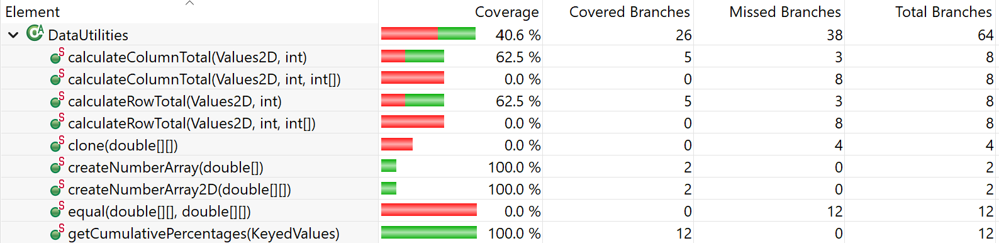
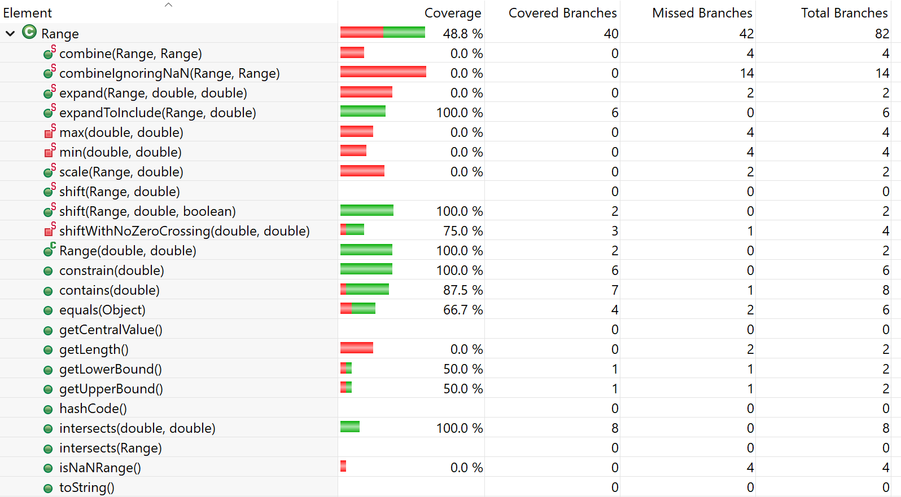
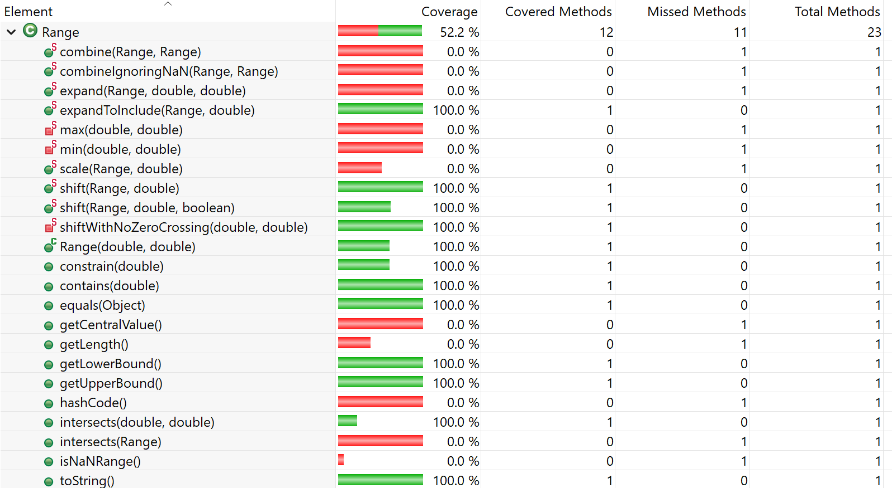

**SENG 438 - Software Testing, Reliability, and Quality**

**Lab. Report #3 – Code Coverage, Adequacy Criteria and Test Case Correlation**

| Group: 6      |
|-----------------|
| Francis, Michael                |   
| Le, Michael              |   
| Pretorius, Jean-Charl               |   
| Rainbow, Sam                |
| Sofela, Samuel                |

# 1 Introduction

This assignment was designed to help us develop an understanding of how to determine the effectiveness of a white-box test suite based on the coverage of the now-accessible code, while also building on the automated unit testing fundamentals learned in Assignment 2. Like in assignment 2, we familiarize ourselves with the JUnit tool in Eclipse. Unlike assignment 2, we will also enhance the test suite and develop test cases based on various white-box testing criteria. This includes control flow coverage criteria like statement coverage, decision coverage, condition coverage, or method coverage and data flow coverage like DU pairs coverage.
Before the start of this assignment, we had applied our knowledge of automated unit testing with JUnit using black-box design techniques like equivalence classes and boundary value testing in Assignment 2. Although we have learned about white-box testing concepts in lectures and know that it uses techniques like control flow and data flow graphs to enhance the test suite, most of us did not have previous experience with using white-box techniques in automated unit testing. 

# 2 Manual data-flow coverage calculations for X and Y methods

## 2.1 DataUtilities.calculateColumnTotal

#### Table 1. Defs, Uses, DU-Pairs
| | |
|:--:|:--:|
|defs|def(1) = {data, column}|
| | def(3) = {total}|
| | def(4) = {rowCount}|
| | def(5) = {r}|
| | def(6) = {n}|
| | def(7) = {total}|
| | def(8) = {r}|
| | def(9) = {r2}|
| | def(10) = {n}|
| | def(11) = {total}|
| | def(12) = {r2}|
|uses|use(2) = {data}|
| | use(4) = {data}|
| | use(5) = {r, rowCount}|
| | use(6) = {data, r, column, n}|
| | use(7) = {total, n}|
| | use(8) = {r}|
| | use(9) = {r2, rowCount}|
| | use(10) = {data, r2, column, n}|
| | use(11) = {total, n}|
| | use(12) = {r2}|
| | use(13) = {total}|
|du-pairs|for data: (1, 2), (1, 4), (1, 6), (1, 10)|
| | for column: (1, 6), (1, 10)|
| | for total: (3, 7), (3, 11), (3, 13), (7, 11), (7, 13), (11, 13)|
| | For rowCount: (4, 5), (4, 9)|
| | For r: (5, 5), (5, 6), (5, 8), (8, 8)|
| | For n: (6, 6), (6, 7), (6, 10), (6, 11), (10, 10), (10, 11)|
| | For r2: (9, 9), (9, 10), (9, 12), (12, 12)|

#### Table 2. DU-Pair Coverage Calculation for Each Test Case
| Variable | Defined at node (n) | DCU (v, n) | DPU (v, n) |
|:--:|:--:|:--:|:--:|
|data|1|{2, 4, 6, 10}|{}|
|column|1|{6, 10}|{}|
|total|3|{7, 11, 13}|{}|
|total|7|{7, 11, 13}|{}|
|total|11|{11, 13}|{}|
|rowCount|4|{}|{(5, 6), (5, 9), (9, 10), (9, 13)}|
|r|5|{6, 8} |{(5, 6), (5, 9)}|
|r|8|{6, 8}|{(5, 6), (5, 9)}|
|n|6|{7}|{(6, 7), (6, 8)}|
|n|10|{11}|{(5, 6), (5, 9)}|
|r2|9|{10, 12}|{(9, 10), (9, 13)}|
|r2|12|{10, 12}|{(9, 10), (9, 13)}|

Total
CUc = 24
PUc = 16

#### Table 3 DU-Pair Coverage
|Test Case|DU-Pairs Covered|CUc + PUc|
|:--:|:--:|:--:|
| calculateColumnTotalFirstColThreeRows | (1, 2), (1, 4), (1, 6), (3, 7), (3, 13), (7, 13), (4, 5), (4, 9), (5, 5), (5, 6), (5, 8), (8, 8), (6, 6), (6, 7), (9, 9) | {6, 8}, {6, 8}, {7}  +  {(5, 6), (5, 9), (9, 10), (9, 13)}, {(5, 6), (5, 9)}, {(5, 6), (5, 9)}, {(6, 7), (6, 8)}, {(9, 10), (9, 13)}, {(9, 10), (9, 13)} |
| calculateColumnTotalMiddleColThreeRows | (1, 2), (1, 4), (1, 6), (3, 7), (3, 13), (7, 13), (4, 5), (4, 9), (5, 5), (5, 6), (5, 8), (8, 8), (6, 6), (6, 7), (9, 9) | {6, 8}, {6, 8}, {7}  +  {(5, 6), (5, 9), (9, 10), (9, 13)}, {(5, 6), (5, 9)}, {(5, 6), (5, 9)}, {(6, 7), (6, 8)}, {(9, 10), (9, 13)}, {(9, 10), (9, 13)} |
| calculateColumnTotalLastColThreeRows | (1, 2), (1, 4), (1, 6), (3, 7), (3, 13), (7, 13), (4, 5), (4, 9), (5, 5), (5, 6), (5, 8), (8, 8), (6, 6), (6, 7), (9, 9) | {6, 8}, {6, 8}, {7}  +  {(5, 6), (5, 9), (9, 10), (9, 13)}, {(5, 6), (5, 9)}, {(5, 6), (5, 9)}, {(6, 7), (6, 8)}, {(9, 10), (9, 13)}, {(9, 10), (9, 13)} |
| calculateColumnTotalNegativeOneRows | (1, 2), (1, 4), (1, 10), (3, 11), (4, 5), (4, 9), (5, 5), (10, 10), (10, 11), (9, 9), (9, 10), (9, 12), (12, 12) | {11}, {10, 12}, {10, 12}  +  {(5, 6), (5, 9), (9, 10), (9, 13)}, {(5, 6), (5, 9)}, {(5, 6), (5, 9)}, {(5, 6), (5, 9)}, {(9, 10), (9, 13)}, {(9, 10), (9, 13)} |
| calculateColumnTotalInvalidDataObject | (1, 2), (1, 4) | |
| calculateColumnTotalZeroRows | (1, 2), (1, 4), (3, 13), (4, 5), (4, 9), (5, 5), (9, 9) | {(5, 6), (5, 9), (9, 10), (9, 13)}, {(5, 6), (5, 9)}, {(5, 6), (5, 9)}, {(5, 6), (5, 9)}, {(9, 10), (9, 13)}, {(9, 10), (9, 13)} |
| calculateColumnTotalNegativeValue | (1, 2), (1, 4), (1, 6), (3, 7), (3, 13), (7, 13), (4, 5), (4, 9), (5, 5), (5, 6), (5, 8), (8, 8), (6, 6), (6, 7), (9, 9) | {6, 8}, {6, 8}, {7}  +  {(5, 6), (5, 9), (9, 10), (9, 13)}, {(5, 6), (5, 9)}, {(5, 6), (5, 9)}, {(6, 7), (6, 8)}, {(9, 10), (9, 13)}, {(9, 10), (9, 13)} |
| calculateColumnTotalNullValue | (1, 2), (1, 4), (1, 6), (3, 7), (3, 13), (7, 13), (4, 5), (4, 9), (5, 5), (5, 6), (5, 8), (8, 8), (6, 6), (6, 7), (9, 9) | {6, 8}, {6, 8}, {7}  +  {(5, 6), (5, 9), (9, 10), (9, 13)}, {(5, 6), (5, 9)}, {(5, 6), (5, 9)}, {(6, 7), (6, 8)}, {(9, 10), (9, 13)}, {(9, 10), (9, 13)} |
| calculateColumnTotalMinimumValue | (1, 2), (1, 4), (1, 6), (3, 7), (3, 13), (7, 13), (4, 5), (4, 9), (5, 5), (5, 6), (5, 8), (8, 8), (6, 6), (6, 7), (9, 9) | {6, 8}, {6, 8}, {7}  +  {(5, 6), (5, 9), (9, 10), (9, 13)}, {(5, 6), (5, 9)}, {(5, 6), (5, 9)}, {(6, 7), (6, 8)}, {(9, 10), (9, 13)}, {(9, 10), (9, 13)} |
| calculateColumnTotalMaximumValue | (1, 2), (1, 4), (1, 6), (3, 7), (3, 13), (7, 13), (4, 5), (4, 9), (5, 5), (5, 6), (5, 8), (8, 8), (6, 6), (6, 7), (9, 9) | {6, 8}, {6, 8}, {7}  +  {(5, 6), (5, 9), (9, 10), (9, 13)}, {(5, 6), (5, 9)}, {(5, 6), (5, 9)}, {(6, 7), (6, 8)}, {(9, 10), (9, 13)}, {(9, 10), (9, 13)} |

Total
CUc = 10/24
PUc = 16/16

CUf = 14/24
PUf = 0/16

All-uses coverage = (CUc + PUc) / [ (CU + PU) - (CUf + PUf) ] = (10 + 16) / [ (16 + 24) - (14 + 0) ] = 26 / ( 40 - 14 ) = 26 / 26 = 100%

## 2.2 Range.intersects

#### Table 4. Defs, Uses, DU-Pairs
| | |
|:--:|:--:|
| defs: | def(1) = {b0, b1} |
| uses: | use(2) = {b0, this.lower} |
| | use(3) = {b1, this.lower} |
| | use(4) = {b0, b1, this.lower} |
| du-pairs: | for b0: (1, 2), (1, 4) |
| | for b1: (0, 2), (0, 4) |

#### Table 5. DU-Pair Coverage Calculation for Each Test Case
| Variable | Def at node (n) | DCU (v, n) | DPU (v, n) |
|:--:|:--:|:--:|:--:|
| b0 | 1 | {} | {(2, 3), (2, 4), (3, END), (4, END)} |
| b1 | 1 | {} | {(4, END)} |

Total
CU = 0
PU = 4

#### Table 6. DU-Pair Coverage
| | |
|:--:|:--:|
| Test Case | DU-pairs covered |
| intersectsWithBLBAndLB | dpu {(2, 3), (3, END)} |
| intersectsWithBLBAndALB | dpu {(2, 3), (3, END)} |
| intersectsWithBLBAndAUB | dpu {(2, 3), (3, END)} |
| intersectsWithLBAndALB | dpu {(2, 3), (3, END)} |
| intersectsWithLBAndUB | dpu {(2, 3), (3, END)} |
| intersectsWithNormalAndNormal | dpu {(2, 4), (4, END)} |
| intersectsWithBUBAndUB | dpu {(2, 4), (4, END)} |
| intersectsWithBUBAndAUB | dpu {(2, 4), (4, END)} |
| intersectsWithUBAndAUB | dpu {(2, 4), (4, END)} |
| intersectsWithInputAUBAndMAX | dpu {(2, 4), (4, END)} |
| intersectsWithInputBLBAndMIN | dpu {(2, 3), (3, END)} |
| intersectsWithInputNaNAnd1 | dpu {(2, 4), (4, END)} |

Total
CUc = 0
PUc = 4

All-uses coverage = (CUc + PUc) / [ (CU + PU) - (CUf + PUf) ] = 100%

# 3 A detailed description of the testing strategy for the new unit test

As part of our planning and testing strategy for our new unit tests, we visualize all possible test cases by creating Control Flow Graphs (CFGs) for each of the methods we tested in Assignment 2 of this course. This provides a guideline that each group member can follow when enhancing the test cases for their respective cases. Each team member was responsible for the method that they tested in assignment 2, and tried to code their tests so that they could hit every node in their respective graph.

For Range:
#### expandToInclude(Range range, double value)
Jean-Charl Pretorius

#### contains(double value)
Michael Le

#### constrain(double value)
Michael Francis

#### intersects(double lower, double upper)
Samuel Sofela

#### shift(Range base, double delta)
Sam Rainbow

For DataUtilities
#### calculateColumnTotal(Values2D data, int column)
Jean-Charl Pretorius

#### calculateRowTotal(Values2D data, int row)
Michael Le

#### createNumberArray2D(double[][] data)
Michael Francis

#### getCumulativePercentages(KeyedValues data)
Samuel Sofela

#### createNumberArray(double[] data)
Sam Rainbow

# 4 A high level description of five selected test cases you have designed using coverage information, and how they have increased code coverage

## 4.1 RangeTest.intersectsWithBUBAndALB()
This test case was used to improve the coverage of the intersects(double, double) method. The initial test coverage for the method was:

| | Required Coverage | Actual Coverage |
|:--:|:--:|:--|
| Instruction | 90.0 % | 100.0 % |
| Branch | 70.0 % | 87.5 % |
| Method | 60.0 % | 100.0 % |

The test coverage meets the minimum requirements. However, we decided to improve on the branch coverage and increase it to 100%. To achieve this, the branch coverage was examined and it was observed that 1 branch was not covered as shown in the yellow-highlighted code below:

Specifically, the branch not covered was for a scenario where b1 < b0.  To fix this, an additional test case was created, RangeTest.intersectsWithBUBAndALB(). In this test case, the intersects method takes the 99.99999 (b0) and ALB -99.99999(b1) as its parameters. This meets the test requirement of b1 < b0.
After the inclusion of this test case, the coverage increased to 100.0%.

| | Required Coverage | Actual Coverage |
|:--:|:--:|:--|
| Instruction | 90.0 % | 100.0 % |
| Branch | 70.0 % | 100.0 % |
| Method | 60.0 % | 100.0 % |

## 4.2 DataUtilitiesTest.negativeColumnCountGiven()
This test case was used to improve the coverage of the calculateRowTotal(Values2D data, int row) method in the DataUtilities class. The initial test coverage for the method was:

| | Required Coverage | Actual Coverage |
|:--:|:--:|:--|
| Instruction | 90.0 % | 72.9 % |
| Branch | 70.0 % | 50.0 % |
| Method | 60.0 % | 100.0 % |

The Assignment 2 test coverage for calculateRowTotal(Values2D data, int row) did not satisfy the minimum requirements, as the instruction coverage of 72.9% and the branch coverage of 50.0% fell significantly short of the required 90.0% and 70.0%, respectively.  Subsequently, we took steps to ensure these requirements would be met by adding test cases that calculated the row total with a mixture of positive numbers, negative numbers, zeroes, or null values. We also added a test called negativeColumnCountGiven() that would specify a negative columnCount value of -1. This means that the missing branch coverage where a FOR loop executes if the value of c2 is greater than the columnCount is now covered, as seen below. Both non-null values and null values are used from the getValue() method in order to ensure both if statement branches are covered.

After the inclusion of this test case, the instruction and branch coverages of DataUtilities.calculateRowTotal(Values2D data, int row) increased to 100.0%.

| | Required Coverage | Actual Coverage |
|:--:|:--:|:--|
| Instruction | 90.0 % | 100.0 % |
| Branch | 70.0 % | 100.0 % |
| Method | 60.0 % | 100.0 % |

## 4.3 RangeTest.withLbCrossingZero()

This test case was used to improve the coverage of the shift(Range, double) method in the Range Class. After seeing the method implementation it was apparent that the shift(Range, double) method only returns a call to shift(Range, double, false) where the third parameter is hard coded “false” as shown below.

This boolean represents whether the upper or lower bound can cross 0.0. As such it was necessary to add a test case which tested the shift(Range, double, boolean) to increase test coverage.

The initial test coverage for the shift(Range, double, boolean) method was:

| | Required Coverage | Actual Coverage |
|:--:|:--:|:--|
| Instruction | 90.0 % | 58.6 % |
| Branch | 70.0 % | 50.0 % |
| Method | 60.0 % | 100.0 % |

As shown below we can the if statement could not be executed by calling shift(Range, double):

Now that we were able to see the code we could understand that in order to test the shift() function we had to pass true as a third parameter to enter this if statement. By allowing zero crossing this branch was tested and the coverage increased to the values below.

| | Required Coverage | Actual Coverage |
|:--:|:--:|:--|
| Instruction | 90.0 % | 100.0 % |
| Branch | 70.0 % | 100.0 % |
| Method | 60.0 % | 100.0 % |

## 4.4 RangeTest.testConstrainUpperBound()

This test case was used to improve the coverage of the constrain(double) method in the Range Class, which returns the value within the range that is closest to the specified value.

The initial test coverage for the constrain(double) method was:

| | Required Coverage | Actual Coverage |
|:--:|:--:|:--|
| Instruction | 90.0 % | 100.0 % |
| Branch | 70.0 % | 83.3 % |
| Method | 60.0 % | 100.0 % |

Although this method satisfied all required coverages, we wanted to see if the branch coverage of 83.3% could be further improved. To do this, testConstrainUpperBound is created to cover the case in which a number above the upper bound is passed as a value and the upper bound is returned.

With this scenario covered, the branch coverage for constrain(double) method is now 100.0% and full coverage is achieved for instruction, branch, and method.

| | Required Coverage | Actual Coverage |
|:--:|:--:|:--|
| Instruction | 90.0 % | 100.0 % |
| Branch | 70.0 % | 100.0 % |
| Method | 60.0 % | 100.0 % |

## 4.5 DataUtilityTestSuite.getCumulativePercentagesTestingWithNEgativeItemCountOneKeyedValueOfNull()

This test case was used to improve the coverage of the getCumulativePercentage(KeyedValues) method in the DataUtilities Class, which returns the KeyedValues instance that contains the cumulative percentage for the data in another KeyedValues instance.

The initial test coverage for the getCumulativePercentage(KeyedValues) method was:

| | Required Coverage | Actual Coverage |
|:--:|:--:|:--|
| Instruction | 90.0 % | 85.2 % |
| Branch | 70.0 % | 75.0 % |
| Method | 60.0 % | 100.0 % |

Although this method satisfied required branch and method coverages, we wanted to see if the instruction coverage of 85.2% could be further improved. To do this, getCumulativePercentagesTestingWithNegativeItemCountOneKeyedValueOfNull() is created to test getCumulativePercentages(KeyedValues) with a negative index and null, and should generate an invocation error.

With this scenario covered, the branch coverage for  getCumulativePercentages(KeyedValues) method is now 100.0% and full coverage is achieved for instruction, branch, and method.

| | Required Coverage | Actual Coverage |
|:--:|:--:|:--|
| Instruction | 90.0 % | 100.0 % |
| Branch | 70.0 % | 100.0 % |
| Method | 60.0 % | 100.0 % |

# 5 A detailed report of the coverage achieved of each class and method (a screen shot from the code cover results in green and red color would suffice)

## 5.1 Coverage from Assignment 2

#### Statement Coverage: DataUtilities.java

#### Branch Coverage: DataUtilities.java

#### Method Coverage: DataUtilities.java

#### Statement Coverage: Range.java

#### Branch Coverage: Range.java

#### Method Coverage: Range.Java

## 5.2 Coverage from Assignment 3

#### Statement Coverage: DataUtilities.java

#### Branch Coverage: DataUtilities.java

#### Method Coverage: DataUtilities.java

#### Statement Coverage: Range.java

#### Branch Coverage: Range.java

#### Method Coverage: Range.Java

## 5.3 Comments

With the method calculateColumnTotal(Values2D data, int column), we only achieve a branch coverage of 62.5%. There are 3 branches that are infeasible because they require the input data to have a negative number of rows, which is not possible. Attempting to create a test case for this results in an error with JMock.

# 6 Pros and Cons of coverage tools used and Metrics you report

For this assignment, we used EclEmma as our coverage tool, which is a free Java code coverage tool for Eclipse. It enables code coverage analysis to be used directly on the Eclipse workbench. A reason for using EclEmma is because of its fast development and test cycle - it can be launched directly from the workbench and perform immediate code coverage analysis. Coverage results are comprehensive and are immediately summarized and highlighted in the console in an organized fashion. EclEmma also does not require modifying your projects or performing any other preliminary setup.

Using EclEmma, we were able to acquire three coverage metrics: statement, branch and method coverages. A benefit to using EclEmma is that most of our group members already had EclEmma installed in their Eclipse workbench, which made for an easier transition to measure control flow coverage. Another useful feature of EclEmma is that it contains metrics for methods coverage, which ensures all methods and functions are executed at least once during testing.  A potential con to using EclEmma is that condition coverage is not available, and condition coverage can be important since it ensures all Boolean evaluations are executed at least once independently during testing. If a user is looking for condition coverage metrics, EclEmma may not be the best choice.

We were also able to try Clover, which has a very nice user interface that lets you view a lot of information about the tests. If there is any way of viewing similar metrics as we saw with EclEmma such as the percentage of branch coverage rather than some total coverage, we were not able to find it. It does show the number of branches, statements, and methods for each test case. Additionally, it has some other interesting features including the ability to generate a treemap report of the code coverage as well as a coverage cloud report.

# 7 A comparison on the advantages and disadvantages of requirements-based test generation and coverage-based test generation.

### Requirements-Based Test Generation:
#### Advantages:
- The functional and non-functional  requirements of the methods are tested which helps identify if the software meets the intended purpose and stakeholders' expectations.
- Testing against requirements can help catch defects at an early stage of development, reducing the cost and effort of fixing issues later in the development lifecycle.
- Since the test cases are developed without seeing the code, there is no bias that may affect the design of the test cases.

#### Disadvantages
- If the requirements are not well-defined or if certain aspects of the software are not covered in the requirements, the generated tests may not address all possible scenarios, leading to gaps in test coverage.
- Requirement based testing may not explore scenarios that are not explicitly specified in the requirements, potentially missing some edge cases and unexpected interactions.
- Prone to human error as the tests must be developed from the understanding of the tester

### Coverage-Based Test Generation
#### Advantages
- Coverage-based testing aims to achieve comprehensive coverage of the code, including statement, branch, and method coverage. It ensures that all parts of the code are exercised, which can help uncover hidden defects.
- Coverage-based testing can often be automated using tools, making it suitable for continuous integration and frequent testing iterations.
- In situations where requirements are not well-documented or the software lacks clear specifications, coverage-based testing can be a practical way to ensure at least a certain level of testing is performed.

#### Disadvantages:
- Coverage-based testing may not directly address the functional correctness or intended behavior of the software, leading to the risk of testing irrelevant or unimportant parts of the code.
- While code coverage metrics provide information about executed code, they do not guarantee that all possible scenarios and combinations of inputs have been tested, leaving some corner cases unexplored.

# 8 A discussion on how the team work/effort was divided and managed

For this assignment, our group divided the work so that we each tested one method from each class “Range” and “DataUtilities” of the JFreeChart library that we had tested in Assignment #2. We collected our results and shared them with the rest of the team for review. Each team member’s responsibilities is oulined below.

- Split tests so that each group member worked on one Range method and one DataUtilities method and got exposure to testing methods from both classes.
- For Range, each group member will test one of the following methods
    - expandToInclude(Range range, double value) - tested by Jean-Charl Pretorius
    - contains(double value) - tested by Michael Le
    - constrain(double value) - tested by Michael Francis
    - intersects(double lower, double upper) - tested by Samuel Sofela
    - shift(Range base, double delta) - tested by Sam Rainbow
- For DataUtilities, each group member will test one of the following 5 methods:
    - calculateColumnTotal(Values2D data, int column) - tested by Jean-Charl Pretorius
    - calculateRowTotal(Values2D data, int row) - tested by Michael Le
    - createNumberArray2D(double[][] data) - tested by Michael Francis
    - getCumulativePercentages(KeyedValues data) - tested by Samuel Sofela
    - createNumberArray(double [] data) - tested by Sam Rainbow (Coverage was already 100%)

# 9 Any difficulties encountered, challenges overcome, and lessons learned from performing the lab

- We learned how to manually calculate the DU-pair coverage. This exercise helped to increase our understanding of the data-flow coverage measures in testing. 
- Analyzing the code to extract the DU-pairs was very difficult at first. 
- It was initially difficult to figure out the missing branches in our original test suite from Assignment 2.
- It was challenging to define test cases that required values which result in an error. For instance, complete test coverage of getCumulativePercentage() of the DataUtilities class required negative values for the for-loop to be tested. This resulted in an invocation error and prevented the program from running in an infinite loop.

# 10 Comments/feedback on the lab itself

- The assignment on code coverage has been a valuable learning experience. It has given us the opportunity to learn how to write good and effective test cases that cover most of the methods being tested in the source code. We have also had the chance to review our work from Assignment 2 and see how well we performed black box testing.
- We used EclEmma, a code coverage tool that is already installed as a plugin in Eclipse. This tool allowed us to visualize the code coverage of our test suite and identify any areas that were not being adequately tested. The functionality of EclEmma to identify missing branches in lines of codes was really helpful.
- The assignment description document, Assignment_Description.md, is very detailed and comprehensive. It provides clear instructions on how to complete the assignment and includes helpful examples.
